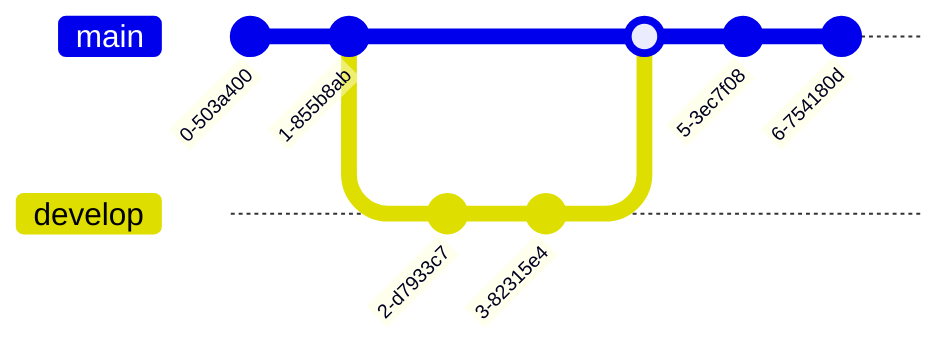

# Guía de contribución

## Envío

Enviar un PR por sub tarea, no enviar PRs con múltiples funcionalidades.

### workflow
<!-- TODO: Especificar workflow -->



### branchs

<!-- TODO: Especificar politicas -->
Un solo developer

```bash
git checkout -b developer/feature
```

Multi developer

```bash
git checkout -b feature/integration
```

```bash
git checkout -b developer/feature
```

## Commits

### Formato del mensaje

Para poder crear changelogs, se seguirá las recomendaciones de [conventional commits](https://www.conventionalcommits.org/en/v1.0.0/#summary)

Cada commit consistirá en un `header` , `body` (opcional) y `footer` (opcional)

```txt
<header>

<body>

<footer>
```

### Header

No debe pasar de los 50 caracteres

```txt
<type>: <resumen>
  │       │             
  │       │   
  │       │
  │       └─⫸Resumen en tiempo presente y transitivo. Sin mayúsculas ni punto final.
  │
  └─⫸ Commit Type: [
  'build',
  'chore',
  'ci',
  'docs',
  'feat',
  'fix',
  'perf',
  'refactor',
  'revert',
  'style',
  'test'
]
```

#### Ejemplo header

```txt
feat: Agrega pasarela de pagos con codigo qr
```

#### Tipos de commit

Must be one of the following:

- build: Cambios que afectan el "build" del sistema o dependencias externas
- ci: Cambios en los archivos de configuración o scripts relacionados con Continuous Integration
- docs: Cambios solo de documentación
- feat: Una funcionalidad nueva
- fix: Fix de un bug
- perf: Cambios que mejoran la performance
- refactor: Cambios que no son ni fix ni nuevas funcionalidades
- style: Cambios que no afectan el sentido del codigo (espacios, formateo , etc)
- test: Se añaden tests faltantes o se corrigen los que ya existían

### Body

No debe exceder los 70 caracteres (opcional, preferir multi línea en caso se exceda).

#### Ejemplo body

```txt
Generación de código QR con la lib XYZ integrando Niubbiz.
```

Explicar el porqué del cambio.

### Footer

Colocar en caso sean BREAKING CHANGE o DEPRECATION

#### Ejemplo footer

```txt
BREAKING CHANGE: Se actualiza el script del iframe de Niubiz para compatibilidad con el lector QR
```

### Ejemplos

Solo header

```bash
git commit -m "docs: Especifica protocolo de commits"
```

Header + Body

```bash
git commit -m "docs: Especifica protocolo de commits" -m "Agrega tipos y estructura del mensaje"
```

Header + Body

```bash
git commit -m "refactor: Traslada peticiones a servicios" -m "SRP por dominio e IoC" -m "DEPRECATION: hooks con la lógica de peticiones quedan deprecados"
```
